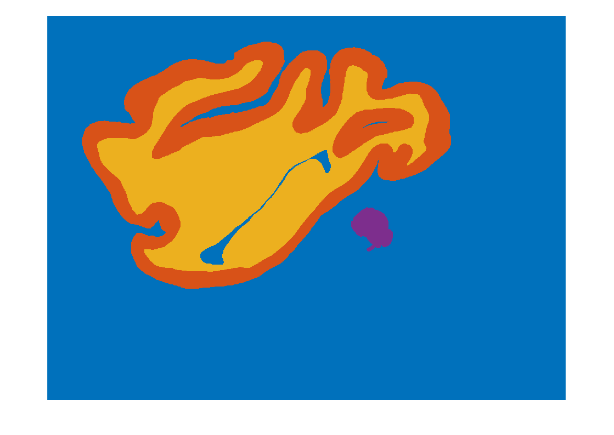

# Analyze Species Toolbox

A MATLAB suite of functions to verify folder structure and file naming for specimen images, read ImageJ ROI files, and generate a labeled tissue mask for gray matter, white matter, and cerebellum.

---

## 1. Installation

1. **Clone the repository**

   ```bash
   git clone https://github.com/yourusername/analyze-species.git
   cd analyze-species
   ```
2. **Add to MATLAB path**

   ```matlab
   addpath(pwd);  % current folder
   savepath;
   ```

## 2. Prerequisites

* **MATLAB** R2020a or later
* **ReadImageJROI** (v1.18.0.0) by Dylan Muir

  1. Download from MATLAB File Exchange:
     [https://www.mathworks.com/matlabcentral/fileexchange/23700-readimagejroi](https://www.mathworks.com/matlabcentral/fileexchange/23700-readimagejroi)
  2. Install in MATLAB:

     ```matlab
     matlab.addons.install('ReadImageJROI.mltbx');
     addpath(fullfile(userpath,'toolbox','ReadImageJROI-1.18.0.0'));
     savepath;
     ```

## 3. Folder Structure & File Naming

Your specimen data must adhere to the following layout:

```
rootFolder/  <-- top-level folder (e.g. Alouatta_seniculus_1170)
├── Species/
│   └── <rootName>/
│       └── <rootName>_<ID>.tif
├── ROI-files/
│   └── <rootName>_roi/
│       └── <rootName>_<ID>_roi.zip
└── Outlines/
    └── <rootName>_outlined/
        └── <rootName>_<ID>_outlined.tif
```

* `<rootName>` must exactly match `rootFolder` name.
* `<ID>` is a consistent identifier (e.g. `001`, `011`, `A1`).
* File extensions:

  * Species & Outlines: `.tif`
  * ROI archives: `.zip`

## 4. ROI Naming & Suffix Rules

Each ROI name (field `strName` in the struct) must end with one of the following suffixes:

| Suffix | Tissue       | Code in mask |
| ------ | ------------ | ------------ |
| `#g`   | Gray matter  | 1            |
| `#i`   | Inner gray   | 1            |
| `#w`   | White matter | 2            |
| `#c`   | Cerebellum   | 3            |
| `#o`   | Outer only   | 0 (cleared)  |

* **Priority**: gray (#g,#i) → white (#w) → cerebellum (#c) → outer (#o) clears all.
* **Overlaps**: ROIs may overlap. The final mask code follows the above fill order and outer-only regions reset to 0.

### Examples of ROI and Species Images

Below are sample images demonstrating correct naming conventions.


*`example1.png`: Screenshot of an ROI file named `Alouatta_seniculus_1170_011_roi.zip` showing contours with suffixes how the should be named in fiji.*



*`example2.png`: Example TIFF image named `Alouatta_seniculus_1170_011_mask.tif` which will be created in a mask folder (created by the script).*

## 5. Usage. Usage

1. **Check a single specimen**

   ```matlab
   analyze_species(rootFolder);
   ```

   * Verifies folder structure and matching Species⇄ROI⇄Outline files.
   * Prints summary and warnings.
   * Calls `process_roi` if all checks pass.

2. **Process ROIs & generate mask**

   ```matlab
   % After analyze_species has passed
   results = process_roi(roiPaths, speciesIDs);
   % roiPaths: cell array of full .zip paths
   % speciesIDs: matching ID tokens

   % To obtain mask for a set:
   mask = create_mask(rois);
   imshow(mask, []);
   ```

3. **Batch processing**

   ```matlab
   parentDir = 'C:\Data';
   entries = dir(parentDir);
   for k = 1:numel(entries)
       name = entries(k).name;
       if entries(k).isdir && ~ismember(name,{'.','..'})
           analyze_species(fullfile(parentDir,name));
       end
   end
   ```

## 6. Function Reference

* **`analyze_species(rootFolder)`**

  * Checks required subfolders (`Species`, `ROI-files`, `Outlines`).
  * Verifies matching file counts and IDs.
  * Prints summary and warnings.
  * Calls `process_roi` for ROI processing.

* **`process_roi(roiPaths, speciesIDs)`**

  * Reads each ROI ZIP via `ReadImageJROI`.
  * Annotates ROI structs with paths and IDs.
  * Lists contour names in Command Window.
  * Calls `create_mask` for each set and computes areas via `calculate_areas`.

* **`create_mask(rois)`**

  * Builds an empty mask of the correct image size.
  * Fills regions according to ROI suffix rules.
  * Returns a uint8 mask with tissue codes.

---

*Copy and paste this Markdown into your `README.md` to document the toolbox.*
